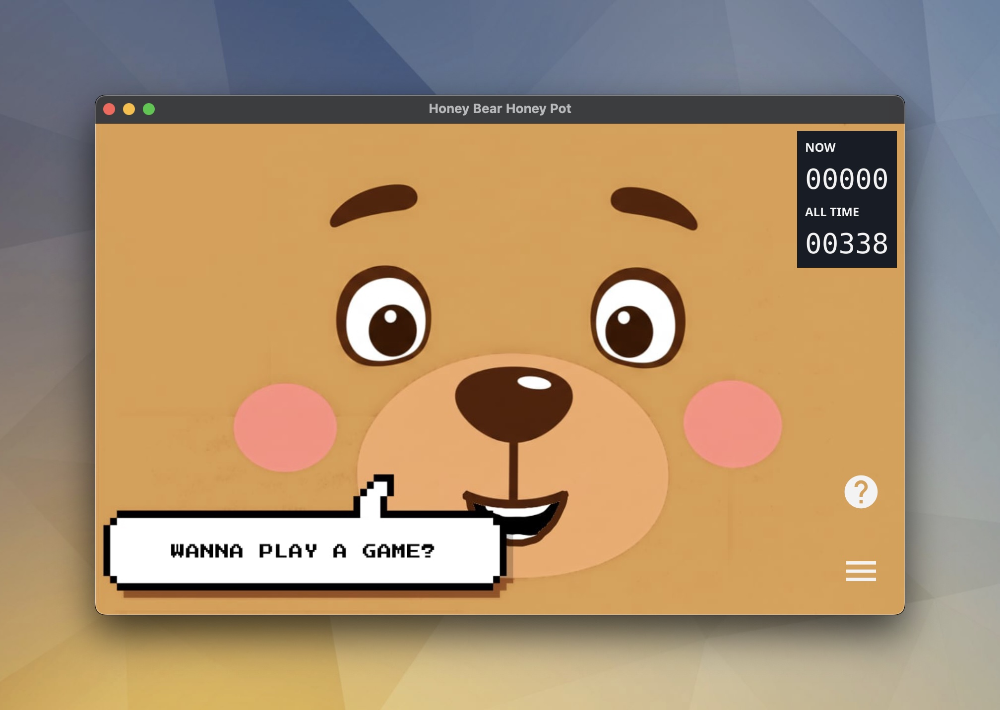

# Honey Bear Honey Pot

A SSH honeypot application that has a whimsical GUI application...and, if you prefer, can run on a hard hat!

See more information about this project: [honeybear.hydrox.fun](https://honeybear.hydrox.fun)

## Installation

### Homebrew (macOS & Linux)

You can install Honey Bear Honey Pot using Homebrew by tapping the official repository:

```bash
$ brew tap mikeflynn/honeybearhoneypot
$ brew install honeybearhoneypot
```

...or simply:

```bash
$ brew install mikeflynn/honeybearhoneypot/honeybearhoneypot
```

After installation, you can run the application using the command:

```bash
$ honeybearhoneypot -h
```

### Linux Packages

You can download `.deb`, `.rpm`, and `.apk` packages from the [Releases](https://github.com/mikeflynn/honeybearhoneypot/releases) page.

**Debian/Ubuntu:**

```bash
sudo dpkg -i honeybearhoneypot_*.deb
```

**RHEL/CentOS/Fedora:**

```bash
sudo rpm -i honeybearhoneypot_*.rpm
```

**Alpine:**

```bash
apk add --allow-untrusted honeybearhoneypot_*.apk
```

### Manual Download

Download the latest binary or package for your architecture from the [Releases](https://github.com/mikeflynn/honeybearhoneypot/releases) page.

## Configuration

The honeypot can be configured using command-line flags when starting the application:

- `-fs`: Start the GUI in full screen mode
- `-height`: Set the height of the GUI window
- `-width`: Set the width of the GUI window
- `-log-level`: Set logging level (debug, info, warn, error, fatal) (default "info")
- `-no-gui`: Run the honey pot without the GUI
- `-no-fun`: Disable non-standard commands (celebrate, ctf, matrix)
- `-pin-reset`: Reset the admin PIN to a specific value
- `-ssh-port`: The port(s) to listen on for honey pot SSH connections (comma separated for multiple ports, default "1337")
- `-export-format`: The format to export data to (json, csv, raw)
- `-export-path`: The directory to export data to
- `-export-types`: The types of data to export (events, options, ctf). Comma separated.
- `-tunnel`: Set up SSH reverse tunnel (format: user@server.com:22)
- `-tunnel-key`: Path to SSH key for reverse tunnel authentication
- `-tunnel-bind`: The address to bind to on the remote server (default "127.0.0.1")
- `-tunnel-remote-port`: The port to forward on the remote server (default "8022")
- `-rate-limit-window`: The window of time to count requests for rate limiting in seconds (e.g. 60)
- `-rate-limit-max`: The maximum number of requests allowed in the window
- `-rate-limit-ban`: The duration to ban an IP for if they exceed the rate limit in seconds (e.g. 300)
- `-config`: Path to a JSON configuration file with the same options

The configuration file can also define additional settings like extra filesystem nodes or CTF tasks. See `misc/config.sample.json` for an example.

## Usage

### The GUI

The GUI provides a visual interface for monitoring and managing the honeypot:

- **Main Display**: Features an animated bear that reacts to user activity (sleeping, working, angry, etc.) and specific events (glitches, hacks).
- **Current Users**: Shows active SSH connections and maximum allowed users.
- **Admin Menu**: Access administrative functions through a PIN-protected interface:
  - Stats: View login statistics, top commands, and recent activity
  - SSH: Configure maximum concurrent users
  - App: System controls including PIN changes and fullscreen toggle
  - Data: Export options or event logs.
- **Tunnel Status**: Indicates reverse tunnel connection status when configured.
- **Notifications**: Displays real-time SSH connection and command activity.

### The SSH Honey Pot

The SSH honeypot component provides a simulated Linux environment ("Hardhat Linux"):

- Accepts any username/password combination for authentication
- Configurable maximum concurrent user limit
- Includes common Linux commands and utilities:
  - File system navigation (`ls`, `cd`, `pwd`)
  - File viewing (`cat`, `less`, `more`)
  - System information (`uname`, `w`, `history`, `id`, `ps`, `env`, `netstat`, `whoami`, `neofetch`)
  - Fun extras (`bearsay`, `cowsay`, `celebrate`, `matrix`)
- **CTF System**: Built-in Capture The Flag game
  - Run `ctf` to register/login and view tasks
  - Run `leaderboard` to see top players
  - Configure tasks via `config.json`
- Records all user activity including:
  - Login attempts
  - Commands executed
  - Connection details
- Optional SSH reverse tunnel support for remote access
- SQLite database for persistent activity logging

## Development / Running Locally

To run the application locally, you will need to have Go installed on your machine. Checkout the repo and run

```bash
$ go run main.go -h

Usage of honeybearhoneypot:
  -config string
        Path to optional JSON config file
  -export-format string
        The format to export data to (json, csv, raw)
  -export-path string
        The directory to export data to
  -export-types string
        The types of data to export (events, options, ctf). Comma separated.
  -fs
        Start the gui in full screen mode
  -height int
        The height of the GUI window
  -log-level string
        Log level (debug, info, warn, error, fatal) (default "info")
  -no-fun
        Disable non-standard commands (celebrate, ctf, matrix)
  -no-gui
        Run the honey pot without the GUI
  -pin-reset string
        Reset the admin PIN to a specific value
  -rate-limit-ban int
        The duration to ban an IP for if they exceed the rate limit in seconds (e.g. 300)
  -rate-limit-max int
        The maximum number of requests allowed in the window
  -rate-limit-window int
        The window of time to count requests for rate limiting in seconds (e.g. 60)
  -ssh-port string
        The port to listen on for honey pot SSH connections. Comma separated list for multiple ports. (default "1337")
  -tunnel string
        The user and host to connect to via SSH. Ex: user@server.com:22
  -tunnel-bind string
        The address to bind to on the remote server. (default "127.0.0.1")
  -tunnel-key string
        The SSH key to use to connect to the specified remote host.
  -tunnel-remote-port string
        The port to forward on the remote server. (default "8022")
  -width int
        The width of the GUI window
```

On first run, it will be a bit slower, but you will see the GUI application pop up.

## Deployment / Exporting

To build a binary for your local environment, you can install the fyne app (`$ go install fyne.io/demo@latest`) and then run:

```bash
$ fyne build
```

If you would like to cross-compile a binary, you will need the [fyne-cross](https://github.com/fyne-io/fyne-cross) application and Docker to cross compile the application for different platforms.

```bash
$ go install github.com/fyne-io/fyne-cross@latest
$ fyne-cross linux
```

The app will be exported to the `fyne-cross/dist` directory as tar file with a Makefile and the application binary.

See more info on the [Fyne app site](https://fyne.io).

## Contributing

Please feel free to submit issues, and especially pull requets!
